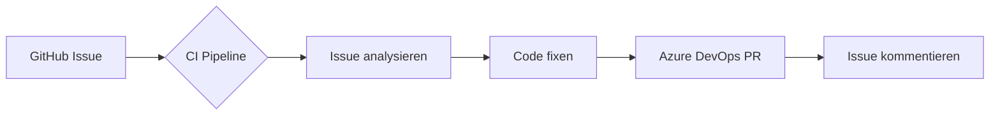

# Cognilayer

> **Cognilayer** — Multi-Tenant SaaS-Plattform mit Angular/.NET/Azure-Stack.
> Dieses Repository dient als Issue-Tracker für die gesamte Cognilayer-Plattform.

## 🔄 Automatisierte Issue-Bearbeitung

Issues werden automatisch analysiert, gefixt und als Azure DevOps PR bereitgestellt:

## Issue-Typen

- **🐛 Bug** — Ein Fehler in der Plattform
- **✨ Feature** — Ein neues Feature / Verbesserung
- **🔧 Maintenance** — Refactoring, Dependencies, CI/CD

## Label-Konvention

| Label | Bedeutung |
|-------|-----------|
| `auto-fix` | Wird aktuell bearbeitet |
| `wontfix` | Wird nicht behoben |
| `needs-info` | Unzureichende Informationen |