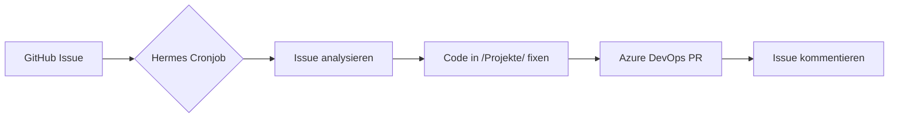

# Cognilayer

> **Cognilayer** — Multi-Tenant SaaS-Plattform mit Angular/.NET/Azure-Stack.
> Dieses Repository dient als **öffentlicher Issue-Tracker** für die gesamte Cognilayer-Plattform.

## 🧠 Automatisierte Issue-Bearbeitung

Issues werden automatisch von **Hermes Agent** analysiert, gefixt und als Azure DevOps PR bereitgestellt:

## Repositories

Die eigentliche Codebasis liegt in **Azure DevOps**:

| Repo | Beschreibung |
|------|-------------|
| `cognilayer-infra` | Azure Bicep Infrastruktur |
| `cognilayer-platform-api` | Backend-API (.NET) |
| `cognilayer-platform-core` | Shared Library (.NET) |
| `cognilayer-portal` | Angular Portal (UI) |
| `cognilayer-marketing` | Angular Marketing (UI) |
| `cognilayer-www` | Angular Public Website |
| `cognilayer-management` | Management-Tools |

## Issue-Typen

- **🐛 Bug** — Ein Fehler in der Plattform
- **✨ Feature** — Ein neues Feature / Verbesserung
- **🔧 Maintenance** — Refactoring, Dependencies, CI/CD

## Label-Konvention

| Label | Bedeutung |
|-------|-----------|
| `auto-fix` | Wird aktuell von Hermes bearbeitet |
| `wontfix` | Wird nicht behoben |
| `needs-info` | Unzureichende Informationen |